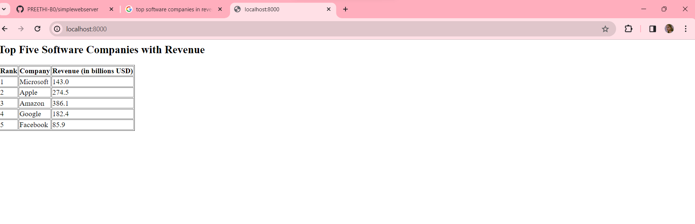

# EX01 Developing a Simple Webserver
## Date:20-02-2024

## AIM:
To develop a simple webserver to serve html pages.

## DESIGN STEPS:
### Step 1: 
HTML content creation.

### Step 2:
Design of webserver workflow.

### Step 3:
Implementation using Python code.

### Step 4:
Serving the HTML pages.

### Step 5:
Testing the webserver.

## PROGRAM:
~~~
from http.server import HTTPServer, BaseHTTPRequestHandler
content = """
<html>
<head>
<h2>Top Five Software Companies with  Revenue</h2>
<head>
<body>
<table border="1">
  <tr>
    <th>Rank</th>
    <th>Company</th>
    <th>Revenue (in billions USD)</th>
  </tr>
  <tr>
    <td>1</td>
    <td>Microsoft</td>
    <td>143.0</td>
  </tr>
  <tr>
    <td>2</td>
    <td>Apple</td>
    <td>274.5</td>
  </tr>
  <tr>
    <td>3</td>
    <td>Amazon</td>
    <td>386.1</td>
  </tr>
  <tr>
    <td>4</td>
    <td>Google</td>
    <td>182.4</td>
  </tr>
  <tr>
    <td>5</td>
    <td>Facebook</td>
    <td>85.9</td>
  </tr>
</table>
</body>
</html>
"""
class myhandler(BaseHTTPRequestHandler):
    def do_GET(self):
        print("request received")
        self.send_response(200)
        self.send_header('content-type', 'text/html; charset=utf-8')
        self.end_headers()
        self.wfile.write(content.encode())
server_address = ('',8000)
httpd = HTTPServer(server_address,myhandler)
print("my webserver is running...")
httpd.serve_forever()
~~~
## OUTPUT:

## RESULT:
The program for implementing simple webserver is executed successfully.
